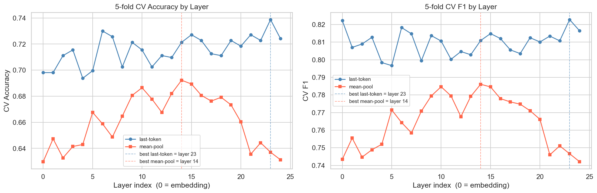
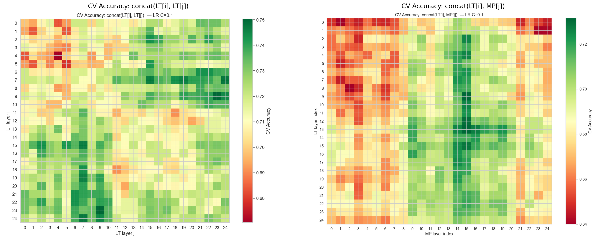
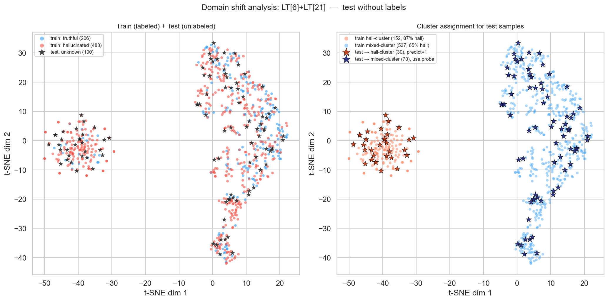

## Final Solution Description

My solution extracts hidden states from layers 6 and 21 of base model, taking the last token position from each of this layers. These two representations are concatenated into a single vector, representing model internal state at an early and a late layers simultaneously.

On top of this representation, two components are trained

- Logistic Regression — binary classifier that maps the vector to a hallucination probability.

- KMeans clusterization (k=2) — a clustering model fitted in a PCA-50 subspace of the same features.

After fitting KMeans model on this features, i discovered that one cluster mostly represents hallucinations, while second is mixed, so at inference time, each sample is first assigned to one of the two clusters and samples falling into the hallucination-cluster are directly labeled as hallucinated, regardless of the logistic regression score. All remaining samples receive the logistic regression prediction.

## Solution Process

#### Stratified cross-validation

The first thing I changed from the baseline was replacing single train/val/test split with stratified cross-validation. The original split reserved 15% for validation and 15% for test, loosing this data from training. With k-fold, every sample participates, so no data is wasted. It also gives a more reliable accuracy, averaging over 5 different subsets rather than one.

Baseline metrics:

| | Accuracy | F1 |
|---|---|---|
| Majority-class baseline | 70.10% | 82.42% |
| MLP probe (baseline) | 71.41% | 79.14% |

#### Layer selection for hidden state representations

I suggested that different layers of a transformer carry different types of information. To find the most informative layers for hallucination detection, I trained a logistic regression on top of each individual layer's representation. I tested two aggregation strategies: last-token and mean-pool (average over all tokens).

Last-token consistently outperforms mean-pool across all layers. The best single layer for last-token is layer 23.
But i decided that combining information from different layers can lead to better representation and can outperform the best individual layer

so I extended the search to pairs of layers. For each pair, the last-token representations from both layers are concatenated and a logistic regression is trained on the result. I searched over all 25×25 combinations of LT+LT pairs and LT+mean-pool pairs.

The best LT+LT pair turned out to be layers 6 and 21 (CV accuracy 0.743), which outperforms any single layer. The LT+mean-pool combinations did not improve over LT+LT.

| Configuration | CV Accuracy | CV F1 |
|---|---|---|
| Majority-class baseline | 70.10% | 82.42% |
| MLP probe (baseline) | 71.41% | 79.14% |
| Best single layer, LR (LT layer 23) | 73.87% | 82.28% |
| Best layer pair, LR (LT[6] + LT[21]) | **74.31%** | 82.38% |

#### Clustering over representations

Visualizing the LT[6]+LT[21] representations with t-SNE showed a clear two-cluster structure in the data.

![t-SNE of LT[6]+LT[21] representations](images/tsne_best_features.png)

One cluster is heavily dominated by hallucinations — about 87% of samples in that cluster are hallucinated. So i decided to label any test sample that falls into this cluster as hallucinated regardless of the classifier score.

I fitted KMeans(k=2) in a PCA-50 subspace of the training features and then identified the hall-dominant cluster. I also tried training a separate logistic regression on each cluster individually, but this did not improve over the global probe with the override.

| Configuration | CV Accuracy | CV F1 |
|---|---|---|
| LR, LT[6]+LT[21], global | 74.31% | 82.38% |
| LR, LT[6]+LT[21], per-cluster probes | 74.89% | 82.79% |
| LR, LT[6]+LT[21], global + hall-cluster override | **75.47%** | **83.47%** |

## Additional Experiments

#### Domain shift analysis

To verify that the test distribution is consistent with the training data, I visualized both sets jointly in the t-SNE space of the LT[6]+LT[21] representations. So the structures of training and test samples are really similar.

And also I trained a logistic regression classifier to distinguish train samples from test samples. The best accuracy was 54.0% - confirming that no meaningful domain shift exists.

#### Experiments that did not improve the result

Also I tried a number of additional approaches, none of which produced meaningful improvements over the final solution:

- Spectral features — for each layer I computed the SVD of the response-token matrix and added singular values, spectral entropy and spectral gap as extra features. The signal was measurable but redundant given the existing representation.

  | Configuration | CV Accuracy |
  |---|---|
  | LT[6]+LT[21] baseline | 74.31% |
  | + spectral[8] all (best) | 74.42% |
  | + entropy all layers | 74.35% |
  | + SV1 all layers | 74.31% |

- Layer triplets (begin–middle–end) — concatenating three layers (one from early, middle, and late parts of the network) did not improve over the best pair.

  | Configuration | CV Accuracy |
  |---|---|
  | LT[6]+LT[21] (best pair) | **74.31%** |
  | LT[6,15,23] concat | 74.16% |
  | LT[2]*0.2+LT[9]*0.2+LT[23]*0.6 | 74.31% |
  | LT[6,9,21] concat | 74.01% |

- Alternative classifiers — Random Forest, Extra Trees, Gradient Boosting, and MLP probes were evaluated on top of LT[6]+LT[21]. There were no meaningful improvements over logistic regression.

  | Classifier | CV Accuracy | CV F1 |
  |---|---|---|
  | LR C=0.1 (final) | **74.31%** | **82.38%** |
  | MLP | 72.86% | 81.45% |
  | Random Forest n=300 | 71.70% | 81.55% |
  | Gradient Boosting lr=0.1 | 69.37% | 80.37% |

- **Ideas from papers** — I implemented several techniques from recent papers on hallucination detection via internal states:

  - *HIDE (2025)* — cosine similarity between prompt and response hidden states as a decoupling signal
  - *ICR Probe (Zhang, 2025)* — layer-to-layer residual norms as a representation drift feature
  - *INSIDE (Chen, 2024)* — log-determinant of the response-token covariance matrix per layer

  | Feature | Best CV Accuracy |
  |---|---|
  | LT[6]+LT[21] baseline | 74.31% |
  | + HIDE cosine (all layers) | 74.16% |
  | + ICR L2 norm (all layers) | 74.02% |
  | + INSIDE logdet (all layers) | 74.45% |

  None produced a consistent improvement when added to the base representation.
